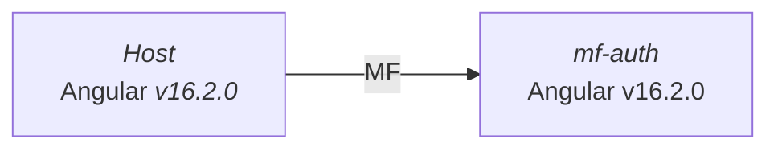

# Microfrontends mono-version con Native Federation

⚠️ Para una mejor experiencia de lectura recomiendo el uso de las siguientes extensiones de VsCode:

- [Markdown Preview Mermaid Support](https://marketplace.visualstudio.com/items?itemName=bierner.markdown-mermaid).
- [Markdown Preview Github Styling](https://marketplace.visualstudio.com/items?itemName=bierner.markdown-preview-github-styles)

Este enfoque no presenta ningún problema de enrutamiento ya que al tener un solo package.json, se comparte el mismo sistema
de enrutamiento `@angular/router` entre los microfrontends.

## Arquitectura

Para este ejemplo se ha decidido utilizar una arquitectura de microfrontends mono-version, es decir, todos los microfrontends comparten la misma versión de Angular.



## Schematics

Para la creación de los microfrontends y host con su respectiva configuración, puedes utilizar los siguientes comandos:

**Comando para crear un nuevo microfrontend:**

```bash
ng g @angular-architects/native-federation:init --project mfe1 --port 4201 --type remote
```

**Comando para crear el host:**

```bash
ng g @angular-architects/native-federation:init --project shell --port 4200 --type dynamic-host
```

> 🚀 Para obtener más información sobre la configuración de microfrontends con Native Federation, puedes consultar
la [documentación](https://github.com/angular-architects/module-federation-plugin/tree/main/libs/native-federation).

## Configuración

La configuración inicial es sencilla, basta con crear una archivo `federation.config.js` en la raíz del proyecto y agregar la siguiente configuración:

```typescript
const { withNativeFederation } = require("@angular-architects/native-federation/config");

module.exports = withNativeFederation({
  skip: ["rxjs/ajax", "rxjs/fetch", "rxjs/testing", "rxjs/webSocket"],
});
```

> En este caso se ha decidido agregar paquetes de rxjs que no necesitamos en runtime.

## Puntos relevantes

El host debe ser el encargado de cargar el archivo `mf-manifest.json` con las rutas de los microfrontends, al final cada ruta
no es más que un `remoteEntry.js` que se carga dinámicamente.

```typescript
// main.ts
initFederation("/assets/federation.manifest.json")
  .catch((err) => console.error(err))
  .then((_) => import("./bootstrap"))
  .catch((err) => console.error(err));
```

Finalmente en las rutas del host:

```typescript
export const routes: Routes = [
  {
    path: "",
    loadComponent: () => import("./pages/page-a/page-a.component").then((m) => m.PageAComponent),
  },
  {
    path: "page-b",
    loadComponent: () => import("./pages/page-b/page-b.component").then((m) => m.PageBComponent),
  },
  {
    path: "authentication",
    loadChildren: () => loadRemoteModule("mfAuthentication", "./routes").then((m) => m.routes), // Load MF Auth
  },
];
```
