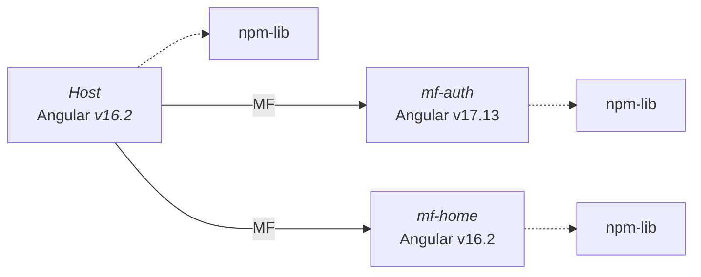

# Microfrontends multi-version con Native Federation

⚠️ Para una mejor experiencia de lectura recomiendo el uso de las siguientes extensiones de VsCode:

- [Markdown Preview Mermaid Support](https://marketplace.visualstudio.com/items?itemName=bierner.markdown-mermaid).
- [Markdown Preview Github Styling](https://marketplace.visualstudio.com/items?itemName=bierner.markdown-preview-github-styles)

Esta App contiene una prototipo base usando una arquitectura de microfrontends con **múltiples
versiones** de Angular e incluso usando diferentes **Bibliotecas de Componentes**.

## Arquitectura

Considerando el uso de múltiples versiones de Angular la recomendación es usar una **librería npm** para
compartir elementos reutilizables entre los microfrontends.



### Bien, pero ¿cómo se logra esto?

Bueno, para ello se recomienda el uso de **Native Federation** y **angular-elements** para convertir un componente Angular en un **web-component**.
Si vemos lo archivos bootstrap de cada microfrontend encontraremos algo como lo siguiente:

```typescript
import { NgZone } from '@angular/core';

(async () => {
  const app = await createApplication({
    providers: […],
  });

  const mfe2Root = createCustomElement(AppComponent, {
    injector: app.injector,
  });

  customElements.define('mfe2-root', mfe2Root);
})();
```

De esa manera creamos el **web-component**, lo registramos en el **DOM** y lo exponemos en el archivo **federation.config**

```typescript
  exposes: {
    "./web-components": "./src/bootstrap.ts",
  }
```

Finalmente el host define un WrapperComponent encargado de cargar cada microfrontend en el DOM. Cada microfrontend cuenta
con su configuración que será usada para la carga.

```typescript
export interface WrapperConfig {
  remoteName: string;
  exposedModule: string;
  elementName: string;
}

@Component([...])
export class WrapperComponent implements OnInit {
  elm = inject(ElementRef);

  @Input() config = initWrapperConfig;

  async ngOnInit() {
    const { exposedModule, remoteName, elementName } = this.config;

    await loadRemoteModule(remoteName, exposedModule);
    const root = document.createElement(elementName);
    this.elm.nativeElement.appendChild(root);
  }
}
```

Rutas del host:

```typescript
export const APP_ROUTES: Routes = [
  [...],
  {
    path: 'passengers',
    component: WrapperComponent,
    data: {
      config: {
        remoteName: 'mfe2',
        exposedModule: './web-components',
        elementName: 'mfe2-root',
      } as WrapperConfig,
    },
  },
  [...]´
];
```

Para encontrar más detalle sobre esta implementación e incluso sobre la posibilidad de crear microfrontends
**multi-version** y **multi-framework** recomiendo leer este articulo de _Angular Architects_: [Micro Frontends with Modern Angular – Part 2: Multi-Version and Multi-Framework Solutions with Angular Elements and Web Components](https://www.angulararchitects.io/blog/micro-frontends-with-modern-angular-part-2-multi-version-and-multi-framework-solutions-with-angular-elements-and-web-components/)

## Problemas de enrutamiento entre microfrontends y solución

Coming soon...

## Ejecución

Para correr cel proyecto seguimos los siguientes pasos:

1. Instalar dependencias del host y microfrontends.
2. Instalar dependencias de la librería compartida.
3. Buildear y linkear la librería a cada microfrontend (esto se realiza ya que la librería es local).

   ```bash
   ng build
   ...
   npm link ../libs/dist/micro-frontends-config-lib --legacy-peer-deps
   ```

4. Ejecutar el comando `npm start` en la carpeta **multi-version** para ejecutar el script **run-fronts-angular.js**,
   este script nos permite ejecutar los mf que deseemos junto con el host.
