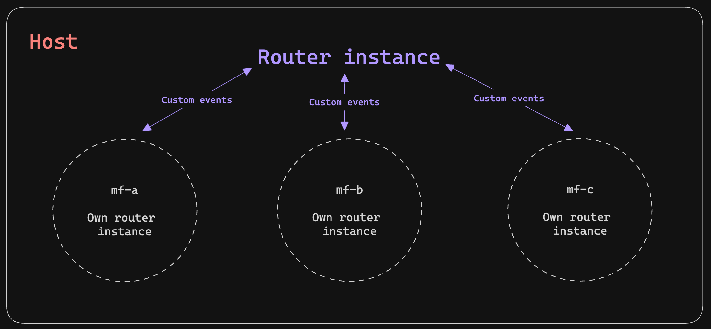

# Problemas de enrutamiento entre microfrontends y solución


Esta solución pinta bien, pero trae consigo un problema de enrutamiento entre microfrontends. Debido a que cada microfront es representado
por un **web-component** y cuenta con sus propios **paquetes**, _genera su propia instancia de enrutamiento local_, es decir, solo conoce sus rutas y no
las externas (del host o de otros microfrontends).

Analizando la problemática se propone usar Custom Events para comunicar el enrutamiento del host hacia los microfrontends y viceversa. Para ello hacemos
uso de la siguiente utilidad transversal ubicada en la librería **micro-frontends-config-lib**:

```typescript
export class RoutingNotifier {
  static notifyHost(routingApi: RoutingAPI) {
    this.notify('notifyHost', routingApi);
  }

  static notifyMf(routingApi: RoutingAPI) {
    this.notify('notifyMf', routingApi);
  }

  private static notify(event: string, routingApi: RoutingAPI) {
    const evento = new CustomEvent(event, {
      detail: routingApi,
    });
    document.dispatchEvent(evento);
  }
}
```

## Comunicación host hacia microfrontends

En el host comenzamos definiendo una suscripción a los eventos del router para comunicarlos hacia los microfrontends, es importante
incluir el **estado del router** y la **url actual** (la usaremos más adelante).

```typescript
ngOnInit() {
  this.subcription = this.router.events.subscribe((event) => {
    if (event instanceof NavigationEnd) {
      RoutingNotifier.notifyMf({
        url: event.urlAfterRedirects,
        state: this.location.getState() as RouterState,
      } as RoutingAPI);
    }
  });
}
```

Además de ello en el app.component de cada mf agregamos un listener para recibir los eventos (url y state) emitidos por el host.

```typescript
 @HostListener('document:notifyHost', ['$event'])
  onNotifyHostNavigate({ detail: { url, state } }: CustomEvent<RoutingAPI>) {
    if (url.includes('authentication')) {
      this.router.navigate([url], { state });
    }
  }
```

> Algo muy importante que la URL contenga el nombre dle micro para que solo realice la navegación en ese caso.

De esta manera podemos navegar desde el host hacia una ruta o subruta de un microfrontend.

## Comunicación microfrontends hacia host

Para este tipo hacemos usos del componente **NotFoundComponent** que se encarga de emitir un evento hacia el host cuando no encuentra una ruta.

```typescript
// mf-auth -> app.routes.ts
{
  path: '**',
  component: NotFoundComponent,
}

// micro-frontends-config-lib -> not-found.component.ts
@Component({
  selector: 'app-not-found',
  template: '',
  standalone: true,
})
export class NotFoundComponent {
  private readonly location = inject(Location);

  constructor() {
    const routingApi: RoutingAPI = {
      url: `${location.pathname.substring(1)}${location.search}`,
      state: this.location.getState() as RouterState,
    };

    RoutingNotifier.notifyHost(routingApi);
  }
}
```

> Hacemos uso de la utilidad **RoutingNotifier** para emitir un evento hacia el host con la URL y el estado del router.

Finalmente en el host agregamos un listener para recibir los eventos emitidos por los microfrontends.

```typescript
  @HostListener('document:notifyHost', ['$event'])
  onNotifyHostNavigate({ detail: { url, state } }: CustomEvent<RoutingAPI>) {
    this.router.navigate([url], { state });
  }
```

Con estas configuraciones conseguimos una navegación **bidireccional** solucionando el problema de enrutamiento entre microfrontends.
